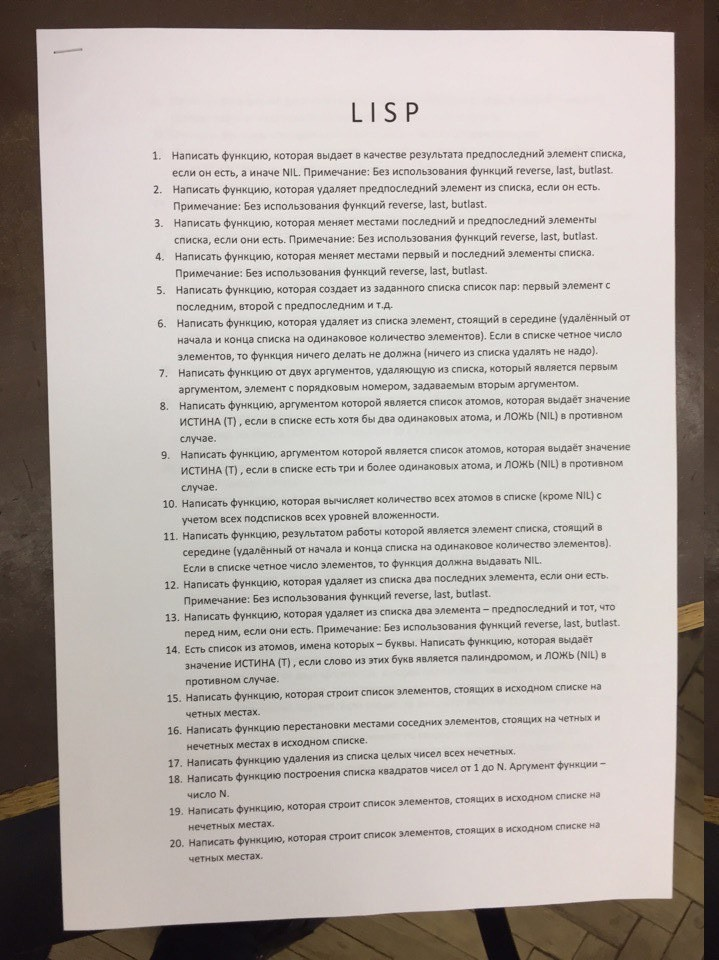
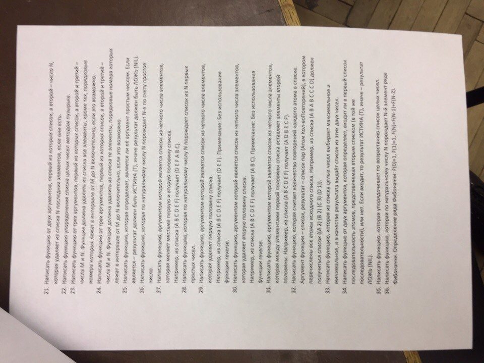

# Языки и методы программирования

Задачи к зачёту, 1 семестр

## Forth

Все решения <a href="./forth-solutions">есть</a>.

### Sources:
- http://wiki.laptop.org/go/Forth_stack_operators
- https://webcache.googleusercontent.com/search?q=cache:ildYPxRlI0oJ:https://learnxinyminutes.com/docs/forth
- https://www.complang.tuwien.ac.at/forth/gforth/Docs-html/Conditional-execution-Tutorial.html
- https://www.complang.tuwien.ac.at/forth/gforth/Docs-html/Counted-Loops.html
- https://www.complang.tuwien.ac.at/forth/gforth/Docs-html/Simple-Loops.html
- http://astro.pas.rochester.edu/Forth/forth-words.html

### Interpreter:
`gforth`

### Problemset:
 </img>
 </img>
 </img>

## Lisp

Все решения <a href="./lisp-solutions">есть</a>.

### Sources:
- https://stackoverflow.com/questions/10771107/lisp-list-vs-s-expression
- https://stackoverflow.com/questions/134887/when-to-use-or-quote-in-lisp

### Key constructs:
- `car`/`cdr`
- `defun`/`let`/`labels`
- `if`/`cond`/`loop for`

### Interpreter:
`sbcl`

### Problemset:
 </img>
 </img>
