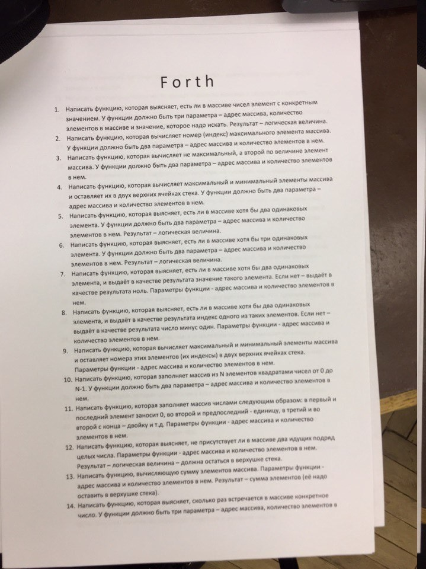
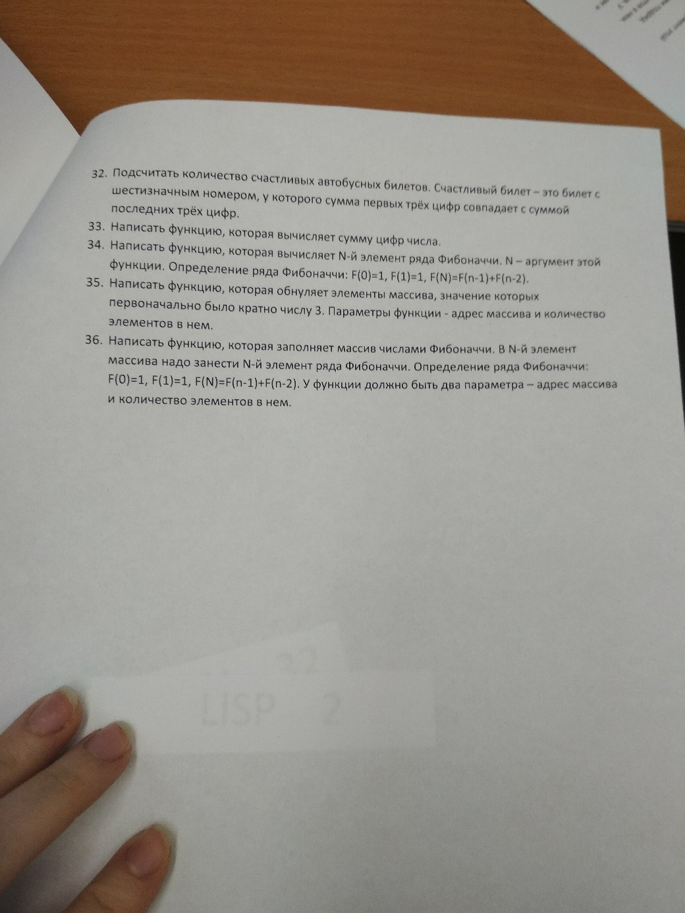

# Языки и методы программирования

Задачи к зачёту

## Forth

### Sources:
- http://wiki.laptop.org/go/Forth_stack_operators
- https://webcache.googleusercontent.com/search?q=cache:ildYPxRlI0oJ:https://learnxinyminutes.com/docs/forth/+&cd=4&hl=en&ct=clnk&gl=ru
- https://www.complang.tuwien.ac.at/forth/gforth/Docs-html/Conditional-execution-Tutorial.html
- https://www.complang.tuwien.ac.at/forth/gforth/Docs-html/Counted-Loops.html

### Interpreter
`gforth`

### Problemset:
 </img>
 </img>
 </img>
